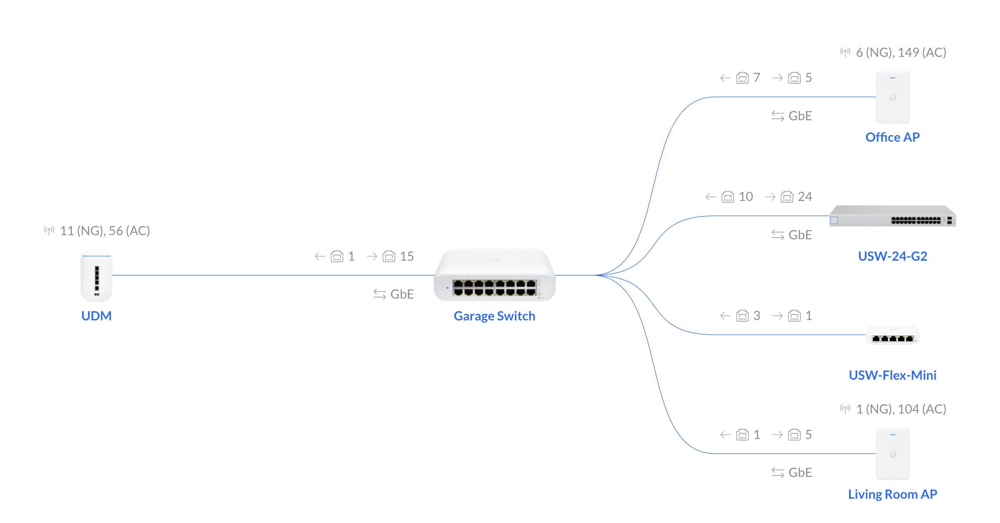

# Unifi homelab setup

## Hardware

My home network looks something like the following:

* [EPB][epbgig] 1GB fiber in ($68/mo)
* [Unifi Dream Machine][udm]
* [Switch Lite 16 PoE][lite16poe]
* 2x [Access Point In-Wall HD][apiwhd]
* [Switch 24][usw24] (for the rack)
* [Switch Flex Mini][flexmini]

Fortunately my house is wired with CAT6 and the cables terminate in the garage.
I've got my UDM sitting on top of the 16 PoE switch, powering the two APs in other parts of the house.

[epbgig]: https://epb.com/fi-speed-internet/gig/
[udm]: https://store.ui.com/collections/unifi-network-unifi-os-consoles/products/unifi-dream-machine
[usw24]: https://store.ui.com/collections/unifi-network-switching/products/usw-24
[apiwhd]: https://store.ui.com/collections/unifi-network-wireless/products/unifi-in-wall-hd
[lite16poe]: https://store.ui.com/collections/unifi-network-switching/products/usw-lite-16-poe
[flexmini]: https://store.ui.com/collections/unifi-network-switching/products/usw-flex-mini

[](./topology.png)


## Unifi Network Configuration

I have 6 VLANs 

| Title | Dedicated WiFi | VLAN | CIDR | Usage | Notes |
|-------|----------------|------|------|-------|-------|
| LAN   | Yes |     | `192.168.1.0/24` | Primary network for laptops, phones, TVs, etc. | |
| IoT   | Yes | 2    | `10.10.10.0/24` | Echo devices, smart appliances, etc. | Only runs 2.4GHz WiFi |
| Work | Yes | 4 | `10.10.0.0/24` | Used for work laptop | Needed IPv6 disabled for corporate VPN to work. |
| Lab Management | No | 3 | `10.1.1.0/24` | Used for IPMI/vPro interfaces | | 
| Lab Net | No | 9 | `172.16.10.0/24` | Used for lab machine network | Set a custom DHCP server to a Lab Management machine
| pihole | No | 5 | `192.168.4.0/24` | Used to run PiHole in a linux container on the UDM | |

## Software

I use the excellent [udm-utilities][udmu] which will let you run linux containers on your UDM/UDMP with persistence across reboots and upgrades.

I have the following utilities enabled on my UDM.
You can find most of them in the udm-utilities repo.

[udmu]: https://github.com/boostchicken/udm-utilities

### SSH Keys

I had to update my SSH config file like so:
```
host udm
	HostName 192.168.1.1
	Port 22
	User root
	IdentityFile ~/.ssh/id_rsa
	PubkeyAcceptedKeyTypes=ssh-rsa
	HostKeyAlgorithms=ssh-rsa
``` 

### PiHole

Blocking adds has vastly improved how I experience the internet.
It really does speed up pageloads, and does away with so many annoying popups.

I lightly modified the configuration to support IPv6, and found it totally worth the $3 to purchase [pihole remote][piholer] for my macOS/iOS devices.

[piholer]: https://apps.apple.com/us/app/pi-hole-remote/id1515445551

### WireGuard

I just use the [wireguard-go][wggo] rather than the kernel module, since the Unifi kernel doesn't natively support WG and I don't need high throughput.

I've configured my WireGuard network to `10.1.2.0` and just keep a manual list of keys in the server config file.
The NAT routing rules were a little annoying to set up, so I've included the rules and a sample config in the [`./wireguard`](./wireguard) folder in this repository.

[wggo]: https://github.com/boostchicken/udm-utilities/tree/master/wireguard-go

If you want (and you most definitely do) PiHole filtering on your mobile device even when you're not home, you can configure the `DNS` setting in the `[Interface]` section of your WireGuard client configuration to the PiHole IP address.

```ini
[Interface]
PrivateKey = <Generate with `wg genkey`>
Address = 10.1.2.12/32
DNS = 192.168.4.3
```

### Dynamic DNS

The Unifi Network controller supports dynamic DNS with several providers like easydns, namecheap, and a few others, but I use Amazon Route53 for management of my personal zones.

I wanted to limit the scope of the credentials that update my home DNS, so I created a second Route53 Hosted Zone and delegeated the `home` subdomain to it.
This way, the AWS IAM credentials on the box cannot change records in the root of my domain.

In order to dynamically update a DNS record, I wrote a [little utility][r53dyndns] that gets run daily on a cronjob to update Route53.
I use it to set 3 DNS records: 
* `ui.home.$MYDOMAIN` for accessing the Unifi web UI, setting `A` and `AAAA` records 
* `vpn.home.$MYDOMAIN` for the WireGuard VPN, setting `A` and `AAAA` records
* `vpn6.home.$MYDOMAIN` for the WireGuard VPN, setting only an `AAAA` record.
  (WireGuard prefers IPv4 over IPv6, so I have a specific address.)

[r53dyndns]: https://github.com/micahhausler/route53-dynamic-dns

Because I now have DNS pointing to my home IP, in Wireguard I can set the `Endpoint` field in the `[Peer]` section to a DNS name.
Here's a complete WireGuard client config:

```ini
[Interface]
PrivateKey = <Generate this with `wg genkey`>
Address = 10.1.2.12/32
DNS = 192.168.4.3

[Peer]
PublicKey = <Server pubkey>
# I've added routes for the vlans at home I want to route to
AllowedIPs = 10.1.2.0/24, 10.1.1.0/24, 192.168.1.0/24, 192.168.4.0/24 
Endpoint = vpn.home.example.com:51280
```

### Let's Encrypt

Since DNS points to my home's IPv4 and IPv6 addresses.
If you want to log into your Unify Network controller without going through Unifi's website, you already have DNS set up, but its an untrusted certificate.
Kyle Christensen does a great job with [udm-le][udm-le], and it has worked well for me.
I had to scratch a little to come up with an IAM policy for this, but it turned out to be the same permissions needed for the Route53 dynamic DNS, so [I've documented it there][r53iam].

[udm-le]: https://github.com/kchristensen/udm-le
[r53iam]: https://github.com/micahhausler/route53-dynamic-dns#required-iam-permissions

## Things I don't have a great answer for

I currently don't version use something like Terraform for managing Unifi Network controller settings.
There seems to be [a provider][unifitf] that gets regular updates, but I've not yet investigated if it supports everything I currently configure, and if that is worth investing the time into.
The biggest advantage I see of this would be programatically setting all the port profiles on the 24 port switch.

[unifitf]: https://registry.terraform.io/providers/paultyng/unifi/latest
